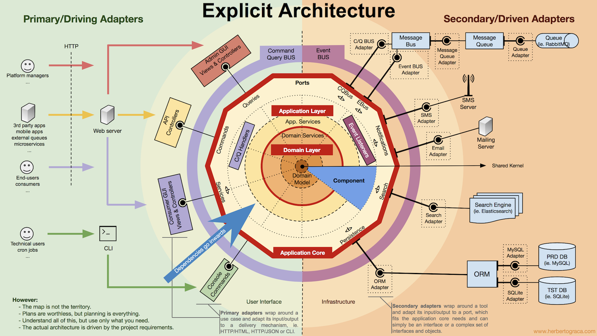

# Projektowanie i implementacja zaawansowanych aplikacji PHP

## Wykład 9: Modelowanie, integracja

### Zakres:

- Warstwy integracyjne projektu
    - Command Bus
        - Szyna wspomagająca rozdzielanie logiki aplikacyjnej do logiki biznesowej
        - Przesyła obiekty rozkazów, reprezentujące decyzje użytkownika
        - Rozkazy mogą być przetwarzane synchronicznie oraz asynchronicznie, z wykorzystaniem np. systemów kolejkowych
        - Najczęstsze założenia:
            - 1 nadawca komuninkatu (rozkazu, commanda) - dokładnie 1 odbiorca
            - Odbiorca po przetworzeniu rozkazu nie zwraca danych, komunikuje się z resztą systemu zdarzeniami
    - Event Bus
        - Przesyła obiekty zdarzeń, reprezentujących zmiany zachodzące w systemie
        - Zdarzenia mogą być przetwarzane syncnhronicznie oraz asynchronicznie, z wykorzystaniem np. systemów kolejkowych
        - Najczęstsze założenia:
            - 1 nadawca komunikatu (zdarzenia, eventu) - dowolnie wielu odbiorców
            - Odbiorca po przetworzeniu rozkazu nie zwraca danych, komunikuje się z resztą systemu zdarzeniami
    - Query Bus
        - Przesyła obiekty zapytań, reprezentujące prośby o dane systemu
        - Zapytania przetwarzane są najczęściej synchronicznie
        - Najczęstsze założenia
            - 1 nadawca komunikatu - dokładnine 1 odbiorca
            - Odbiorca zwraca przez szynę dane do nadawcy 
- Hexagonal Architecture, a.k.a. Ports & Adapters Architecture
    - "Allow an application to equally be driven by users, programs, automated test or batch scripts, and to be developed and tested in isolation from its eventual run-time devices and databases." - Alistair Cockburn

### Hexagonal Architecture

   
     
### Materiały uzupełniające

- [Hexagonal Architecture, Alistair Cockburn](http://alistair.cockburn.us/Hexagonal+architecture)
- [Ports & Adapters Architecture, Herberto Graca](https://herbertograca.com/2017/09/14/ports-adapters-architecture/)
- [DDD, Hexagonal, Onion, Clean, CQRS, Herberto Graca](https://herbertograca.com/2017/11/16/explicit-architecture-01-ddd-hexagonal-onion-clean-cqrs-how-i-put-it-all-together/)
- [Prooph Service Bus, biblioteka](https://github.com/prooph/service-bus)
- [Tactician Service Bus, biblioteka](https://tactician.thephpleague.com) 
- [Responsibilities of Command Bus, Matthias Noback](https://matthiasnoback.nl/2015/01/responsibilities-of-the-command-bus/)
- [Aware of Command Bus, Matthias Noback](https://matthiasnoback.nl/2015/01/a-wave-of-command-buses/)
